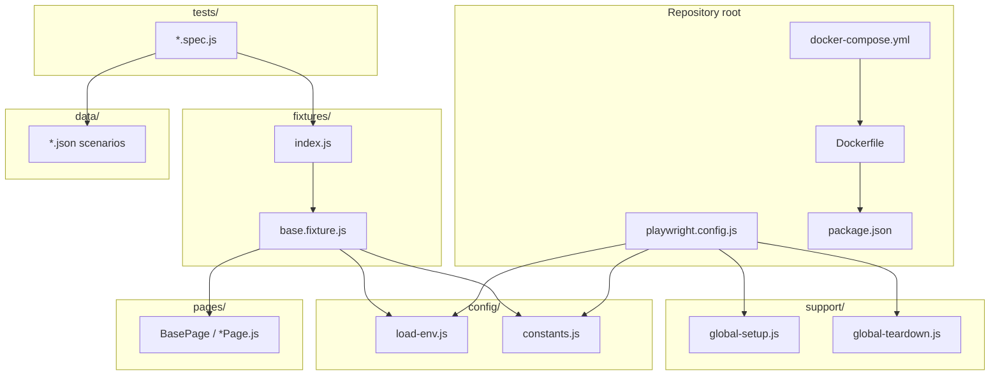
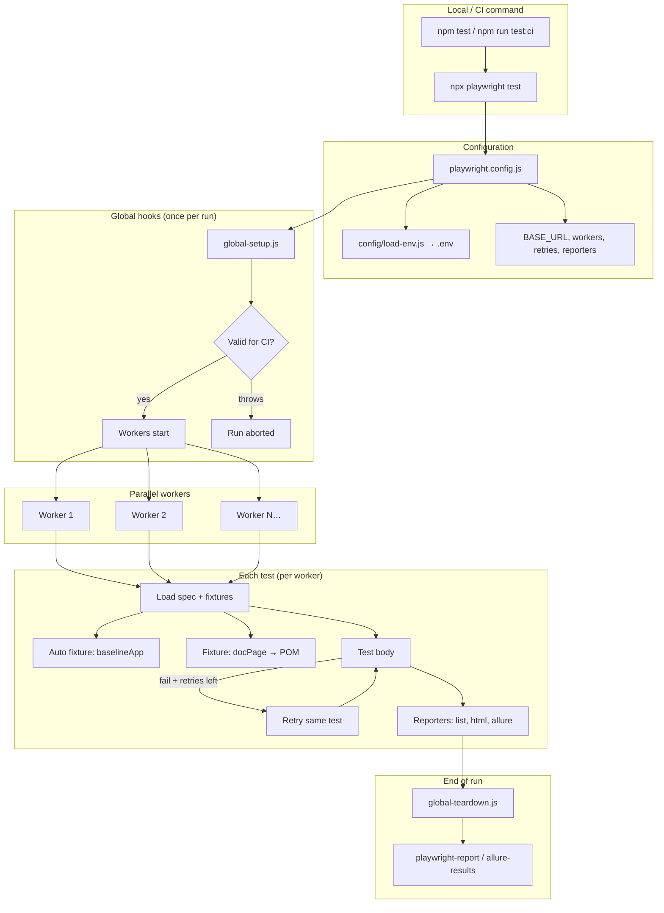
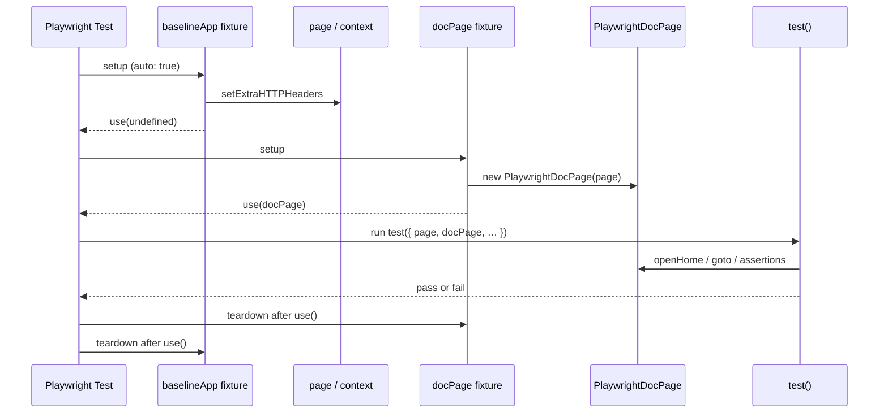
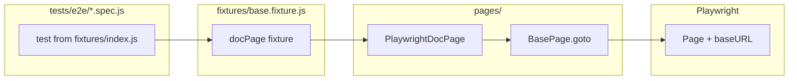
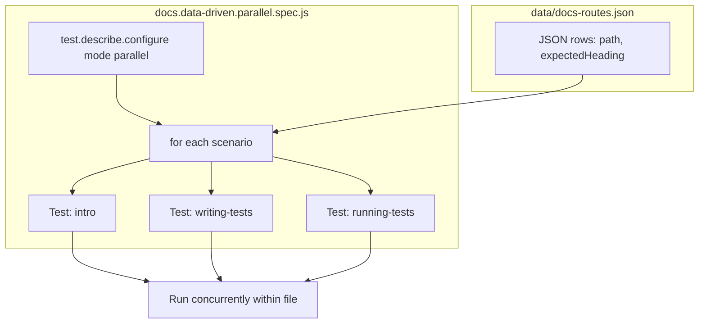
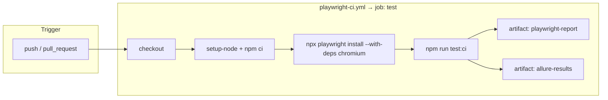
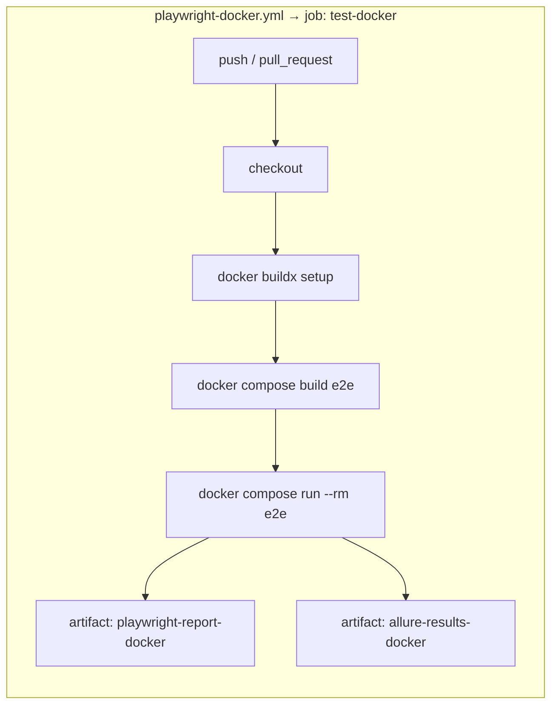
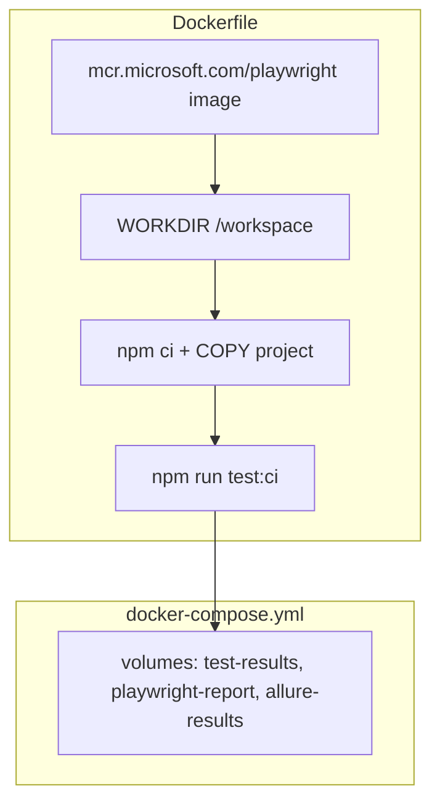

# Playwright framework — execution flow

This document describes how this repo’s test run is orchestrated, **what each folder is for**, and how pieces connect. Diagrams use [Mermaid](https://mermaid.js.org/); they render on GitHub, in many IDEs, and in Markdown preview tools.

---

## How the pieces connect (short narrative)

1. **`playwright.config.js`** (repo root) is the entry point: it loads **`config/load-env.js`**, reads **`config/constants.js`** for defaults like `BASE_URL`, registers **`support/global-setup.js`** / **`support/global-teardown.js`**, and points **`testDir`** at **`tests/`**.
2. Specs under **`tests/`** import **`fixtures/index.js`**, which extends Playwright’s `test` with **`fixtures/base.fixture.js`** (custom fixtures, POM wiring).
3. UI logic and selectors live in **`pages/`** (Page Object Model); raw scenario rows can live in **`data/`** and be read from specs.
4. After a run, Playwright and Allure write **generated** folders (`test-results/`, `playwright-report/`, `allure-results/`); Allure’s HTML output is typically `allure-report/` when you generate it locally.
5. **CI** runs from **`.github/workflows/`** (Node job vs Docker job); **Docker** uses **`Dockerfile`** + **`docker-compose.yml`** so the same image runs locally or in `playwright-docker.yml`.

---

## Repository layout (folders and use)

| Location | Purpose |
|----------|---------|
| **`config/`** | Loads `.env` before other modules read variables (`load-env.js`); shared constants such as `BASE_URL` and timeouts (`constants.js`). Keeps environment concerns out of specs. |
| **`data/`** | Static test inputs (e.g. JSON for data-driven tests). Treat as read-only fixtures; no secrets here—use CI secrets or `.env` for credentials. |
| **`docs/`** | Human-written documentation for the framework (this file, diagrams, onboarding). Not executed by Playwright. |
| **`fixtures/`** | Custom **`test`** built with `test.extend({ … })`: shared setup (e.g. POM instances, `auto: true` headers), re-exported via `fixtures/index.js` so specs import one place. |
| **`pages/`** | Page Object Model: one class per page/area, encapsulating URLs, locators, and user flows. Specs stay short; UI changes touch fewer files. |
| **`support/`** | **Global** lifecycle: `global-setup.js` / `global-teardown.js` run once per test run (configured in `playwright.config.js`). Use for env checks, DB seeds, auth files—not per-test logic (that belongs in fixtures). |
| **`tests/`** | All `*.spec.js` files Playwright discovers (see `testDir`). **`tests/e2e/`** holds main examples; root-level specs are fine for small smokes. |
| **`.github/workflows/`** | CI pipelines: **`playwright-ci.yml`** runs Node + `npm ci` + browser install on the runner; **`playwright-docker.yml`** builds and runs the same suite in Docker. |
| **Root** (`Dockerfile`, `docker-compose.yml`, `package.json`, `playwright.config.js`) | Container definition, local compose overrides/volumes, dependencies/scripts, and main Playwright config. |

### Generated / third-party (usually not committed)

| Location | Purpose |
|----------|---------|
| **`node_modules/`** | npm dependencies; created by `npm ci` / `npm install`. |
| **`test-results/`** | Playwright run output: traces, screenshots on failure, metadata. |
| **`playwright-report/`** | Built-in HTML reporter output. |
| **`allure-results/`** | Raw Allure result files from `allure-playwright`. |
| **`allure-report/`** | Generated after `allure generate` (or `npm run report:allure`); not the same as `allure-results`. |

---

## Folder dependency flow (what imports what)

---

## 1. End-to-end run (CLI → reports)

---

## 2. Single test lifecycle (fixtures + POM)

---

## 3. Page Object (POM) call path

---

## 4. Data-driven parallel block

---

## 5. CI pipelines (GitHub Actions — two workflows)

**`playwright-ci.yml`** — tests on the GitHub runner with Node (no Docker image for the app under test).

**`playwright-docker.yml`** — same suite, separate workflow: build image, run `docker compose run`, upload artifacts (names suffixed with `-docker`).

---

## 6. Docker flow (local or CI)

Local: `npm run docker:build` then `npm run test:docker` (writes reports into the mounted folders at repo root).

---

## Quick file map (key files, not folders)

| Stage | File |
|--------|------|
| Env before config | `config/load-env.js` |
| URLs / timeouts | `config/constants.js` |
| Main config | `playwright.config.js` |
| Global hooks | `support/global-setup.js`, `support/global-teardown.js` |
| Custom test + fixtures | `fixtures/base.fixture.js`, `fixtures/index.js` |
| POM | `pages/BasePage.js`, `pages/PlaywrightDocPage.js` |
| CI (Node on runner) | `.github/workflows/playwright-ci.yml` |
| CI (Docker) | `.github/workflows/playwright-docker.yml` |
| Container | `Dockerfile`, `docker-compose.yml` |
| Env template | `.env.example` |
| Ignore Docker build context | `.dockerignore` |
